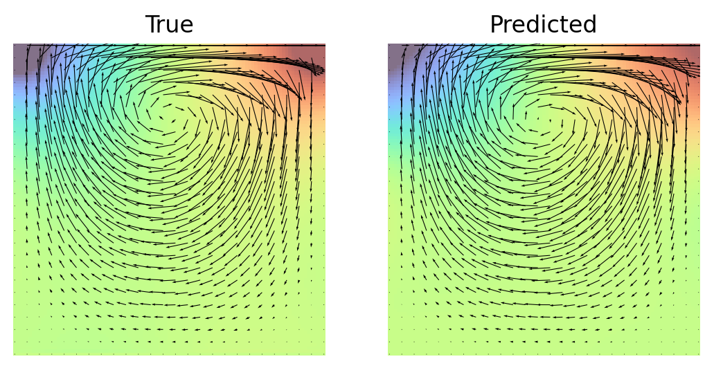

# PI-DeepONets with Zero Coordinate Shift (ZCS)

Zero Coordinate Shift (ZCS) is a low-level technique for maximizing memory and 
time efficiency of physics-informed DeepONets ([Leng et al., 2023](https://arxiv.org/abs/2311.00860)). 
In this tutorial, we will explain how to activate ZCS for an existing DeepXDE script.
Usually ZCS will reduce GPU memory consumption and wall time for training by an order of magnitude.

## Prerequisite

Your current script can be easily equipped with ZCS if you are using

* TensorFlow 2.x, PyTorch or Paddle as the backend,
* `dde.data.PDEOperatorCartesianProd` as the data class, and
* `dde.nn.DeepONetCartesianProd` as the network class.

## Usage

Activating ZCS support includes two steps.

#### Step 1: Replacing the classes in the following table

| **FROM**                                | **TO**                                 |
|-----------------------------------------|----------------------------------------|
| `deepxde.data.PDEOperatorCartesianProd` | `deepxde.zcs.PDEOperatorCartesianProd` |
| `deepxde.Model`                         | `deepxde.zcs.Model`                    |

#### Step 2: Changing the PDE equation(s) to ZCS format

In DeepXDE, the user function for the PDE equation(s) is declared as

```python
def pde(x, u, v):
    # ...
```

To use ZCS, we first create a `deepxde.zcs.LazyGrad` object, passing `x` and `u` as the arguments.
The derivatives of `u` w.r.t. `x` at any high `orders` can then be computed by `LazyGrad.compute(orders)`. 
For example, the Laplace equation ($u_{xx}+u_{yy}=0$) can be coded as

```python
def pde(x, u, v):
    grad_u = dde.zcs.LazyGrad(x, u)
    du_xx = grad_u.compute((2, 0))
    du_yy = grad_u.compute((0, 2))
    return du_xx + du_yy
```

**Note**: `deepxde.zcs.LazyGrad` is smart enough to avoid re-calculating any lower-order derivatives
if a higher-order one has been calculated based on them. For example, in the above function, if you add
`du_x = grad_u.compute((1, 0))` *after* `du_xx = grad_u.compute((2, 0))`, `du_x` will be returned
instantly from a cache inside `grad_u` without extra computation.

These are all you need!


## Example 1: diffusion reaction
In this example, we activate ZCS in the demo of diffusion reaction equation.
The PDE is $u_{t} - D u_{xx} + k u^2 -v=0$, which is implemented in 
[the original script](https://github.com/lululxvi/deepxde/tree/master/examples/operator/diff_rec_aligned_pideeponet.py)
as

```python
def pde(x, u, v):
    D = 0.01
    k = 0.01
    du_t = dde.grad.jacobian(u, x, j=1)
    du_xx = dde.grad.hessian(u, x, j=0)
    return du_t - D * du_xx + k * u ** 2 - v
```

In [the ZCS script](https://github.com/lululxvi/deepxde/tree/master/examples/operator/diff_rec_zcs_pideeponet.py),
we change the PDE to (after replacing the classes in Step 1)

```python
def pde(x, u, v):
    D = 0.01
    k = 0.01
    grad_u = dde.zcs.LazyGrad(x, u)
    du_t = grad_u.compute((0, 1))
    du_xx = grad_u.compute((2, 0))
    return du_t - D * du_xx + k * u ** 2 - v
```

The GPU memory and wall time we measured on a Nvidia V100 (with CUDA 12.2) are reported below.
For these measurements, we have increased the number of points in the domain from 200 to 4000, as 200
is too small in real applications. Time is measured for 1000 iterations.

| **BACKEND** | **METHOD** | **GPU / MB** | **TIME / s** | 
|-------------|------------|--------------|--------------|
| PyTorch     | Aligned    | 5779         | 186          |
|             | Unaligned  | 5873         | 117          |
|             | ZCS        | 655          | 11           |
| TensorFlow  | Aligned    | 9205         | 73 (jit)     |
|             | Unaligned  | 11694        | 70 (jit)     |
|             | ZCS        | 591          | 35 (no jit)  |
| Paddle      | Aligned    | 5805         | 197          |
|             | Unaligned  | 6923         | 385          |
|             | ZCS        | 1353         | 15           |


## Example 2: Stokes flow

### The Problem
In this example, we use a PI-DeepONet to approach the system of Stokes for fluids. 
The domain is a 2D squire box full of liquid, with its lid moving horizontally 
at a given variable speed. The full equations and boundary conditions are

$$
\begin{aligned}
& -\mu \Delta \mathbf{u} + \nabla p = 0;\\
& \nabla \cdot \mathbf{u} = 0; \\
& u_1(x, 1) = f(x),\ u_1(x, 0) = 0,\ u_1(0, y) = 0,\ u_1(1, y) = 0; \\
& u_2(x, 1) = 0,\ u_2(x, 0) = 0,\ u_2(0, y) = 0,\ u_2(1, y) = 0; \\
& p(x, 0) = 0.
\end{aligned}
$$

We learn a operator mapping from $f(x)$ to $\mathbf{u}(x, y)$ and $p(x, y)$. The
true solution for validation is computed using [FreeFEM++](https://freefem.org/) 
following [this tutorial](https://doc.freefem.org/tutorials/stokes.html).

### PDE implementation
Without ZCS, [the DeepXDE script with aligned points](https://github.com/lululxvi/deepxde/tree/master/examples/operator/stokes_aligned_pideeponet.py)
implements the PDE as
```python
def pde(xy, uvp, aux):
    mu = 0.01
    # first order
    du_x = dde.grad.jacobian(uvp, xy, i=0, j=0)
    dv_y = dde.grad.jacobian(uvp, xy, i=1, j=1)
    dp_x = dde.grad.jacobian(uvp, xy, i=2, j=0)
    dp_y = dde.grad.jacobian(uvp, xy, i=2, j=1)
    # second order
    du_xx = dde.grad.hessian(uvp, xy, i=0, j=0)
    du_yy = dde.grad.hessian(uvp, xy, i=0, j=1)
    dv_xx = dde.grad.hessian(uvp, xy, i=1, j=0)
    dv_yy = dde.grad.hessian(uvp, xy, i=1, j=1)
    motion_x = mu * (du_xx + du_yy) - dp_x
    motion_y = mu * (dv_xx + dv_yy) - dp_y
    mass = du_x + dv_y
    return motion_x, motion_y, mass
```

[The DeepXDE script with ZCS](https://github.com/lululxvi/deepxde/tree/master/examples/operator/stokes_zcs_pideeponet.py)
implements the PDE as
```python
def pde(xy, uvp, aux):
    mu = 0.01
    u, v, p = uvp[..., 0:1], uvp[..., 1:2], uvp[..., 2:3]
    grad_u = dde.zcs.LazyGrad(xy, u)
    grad_v = dde.zcs.LazyGrad(xy, v)
    grad_p = dde.zcs.LazyGrad(xy, p)
    # first order
    du_x = grad_u.compute((1, 0))
    dv_y = grad_v.compute((0, 1))
    dp_x = grad_p.compute((1, 0))
    dp_y = grad_p.compute((0, 1))
    # second order
    du_xx = grad_u.compute((2, 0))
    du_yy = grad_u.compute((0, 2))
    dv_xx = grad_v.compute((2, 0))
    dv_yy = grad_v.compute((0, 2))
    motion_x = mu * (du_xx + du_yy) - dp_x
    motion_y = mu * (dv_xx + dv_yy) - dp_y
    mass = du_x + dv_y
    return motion_x, motion_y, mass
```

Both of them should be self-explanatory. 


### Results
After 50,000 iterations for training, the error for both velocity and pressure should
converge to around 10%. The following figure shows the true and the predicted solutions.
Note that ZCS does not affect the accuracy of the resultant model. 
You may want to decrease the number of iterations for a quicker run.



The memory and time measurements on a Nvidia V100 (with CUDA 12.2)
are given below (time measured for 1000 iterations):

| **BACKEND** | **METHOD** | **GPU / MB** | **TIME / s** | 
|-------------|------------|--------------|--------------|
| PyTorch     | Aligned    | 5779         | 186          |
|             | ZCS        | 655          | 11           |
| TensorFlow  | Aligned    | 9205         | 73 (jit)     |
|             | ZCS        | 591          | 35 (no jit)  |


## Complete code
* [Diffusion reaction equation with aligned points](https://github.com/lululxvi/deepxde/tree/master/examples/operator/diff_rec_aligned_pideeponet.py)
* [Diffusion reaction equation with unaligned points](https://github.com/lululxvi/deepxde/tree/master/examples/operator/diff_rec_unaligned_pideeponet.py)
* [Diffusion reaction equation with ZCS](https://github.com/lululxvi/deepxde/tree/master/examples/operator/diff_rec_zcs_pideeponet.py)
* [Stokes flow with aligned points](https://github.com/lululxvi/deepxde/tree/master/examples/operator/stokes_aligned_pideeponet.py)
* [Stokes flow with ZCS](https://github.com/lululxvi/deepxde/tree/master/examples/operator/stokes_zcs_pideeponet.py)

